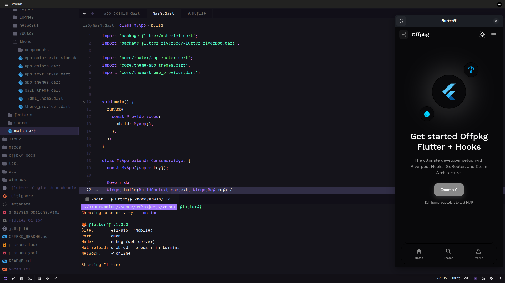

# flutterff 🦊


**The lightweight, native mobile-first launcher for Flutter web development on Linux.**

---

`flutterff` (Flutter Fast Forward) is a minimal, borderless development container for Flutter web applications. It uses **GTK 3** and **WebKit2** directly to provide a high-performance, mobile-first preview experience without the overhead of a full browser.



## ✨ Core Features

- ⚡ **Lightning Fast**: Near-instant startup and extremely low RAM footprint.
- 📱 **Mobile First**: Built-in device presets (iPhone, Android, Tablet) with one-click switching.
- 🔥 **Hot Reload/Restart**: Native header bar controls and terminal shortcuts for instant updates.
- 🦊 **Native Focus**: Draggable header bar, standard window controls, and desktop integration.
- 📸 **Rock-Solid Screenshots (v2.7.0)**: New 3-tier capture engine (GDK/WebKit/Cairo) ensures pixel-perfect shots across any screen size on both X11 and Wayland.
- 🌐 **Offline Mode**: Develop without internet reliance using `--offline`.

## 🚀 Quick Start

Ensure you have the system dependencies:
```bash
sudo apt install python3-gi gir1.2-gtk-3.0 gir1.2-webkit2-4.1
```

Install `flutterff` globally (installs to `~/.local/bin`):
```bash
bash setup.sh
```

Run inside any Flutter project:
```bash
flutterff
```

## 📖 Documentation

Explore the detailed documentation:

- **[Installation Guide](docs/installation.md)**: How to set up and update the tool.
- **[Usage & Shortcuts](docs/usage.md)**: Command-line flags and interactive controls.
- **[Architecture](docs/architecture.md)**: How the tool works under the hood.
- **[Modifying Presets](docs/modification.md)**: Adding your own device sizes.
- **[Examples](docs/examples.md)**: Practical workflows and command examples.

---

_Made for Flutter developers who value performance and a native Linux workflow._
