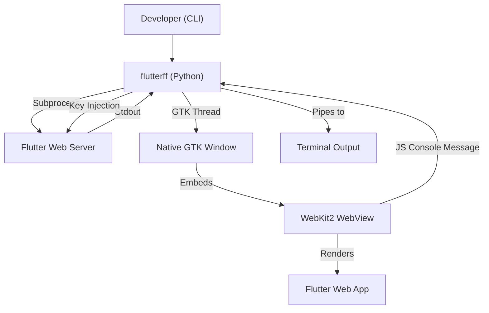

# Architecture & How it Works

`flutterff` is a Python-based wrapper that orchestrates three main components: a Flutter subprocess, a GTK-based native window, and a WebKit2 WebView.

## 🏗️ System Overview

## 1. Process Management

When you run `flutterff`:
1.  It starts the **Flutter Web Server** as a subprocess using `subprocess.Popen`.
2.  It uses **Threading** to monitor the server's `stdout` and `stderr` in the background.
3.  It parses the output to find the development URL (e.g., `http://localhost:8080`).

## 2. The Native UI Layer

Instead of using a general-purpose browser, `flutterff` builds a minimal window using **PyGObject (GI)**:
- **GTK 3**: Used for the window frame, header bar, and buttons.
- **WebKit2GTK**: A full-featured browser engine embedded directly into the GTK box.
- **GLib**: Manages the main event loop and handles asynchronous tasks (like waiting for the server to be ready).

## 3. Log Redirection (The Bridge)

One of the most important features is console log redirection:
1.  `flutterff` injects a small **JavaScript snippet** into every page load.
2.  This snippet overrides `console.log`, `console.error`, etc.
3.  It sends the messages to a **WebKit UserContentManager** script handler.
4.  The Python script receives these messages and prints them to your terminal with timestamps and color-coding.

## 4. Hot Reload/Restart Flow

When you press `r` or click the lightning bolt:
1.  The Python script writes "r" to the `stdin` of the Flutter subprocess.
2.  Flutter performs its internal re-compilation.
3.  Python waits for a short delay (usually 800ms) and then tells the WebKit WebView to reload the current URI.

## 5. Security & Isolation

- **Custom User Agent**: Specifically set up for mobile simulation.
- **WebKit Settings**: Development extras (Right Check > Inspect) are enabled by default for debugging.
- **Cache Management**: Uses the `DOCUMENT_VIEWER` cache model to keep RAM usage low.
